# Example: one minute in one run

A 59.7-second Ref2VA clip (1433 frames, 864x480, 24 fps, with audio) rendered
in a single Endless Sampler run from nine manually written chunks.

| File | What it is |
|---|---|
| `prompt.txt` | The `full_prompt` document: header, six-section base prompt, nine chunk blocks |
| `refs/picture_1_traveller.png` | `<Picture 1>` |
| `refs/picture_2_conductor.png` | `<Picture 2>` |
| `refs/picture_3_carriage.png` | `<Picture 3>` |
| `refs/image_prompts.txt` | Text-to-image prompts used to make the three references |
| `output.mp4` | The rendered result |

## Samples

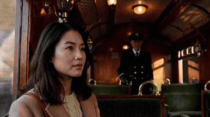

**Full video:** [`output.mp4`](output.mp4) (59.7 s, with audio)

### Reference images

| `<Picture 1>` | `<Picture 2>` | `<Picture 3>` |
|---|---|---|
| 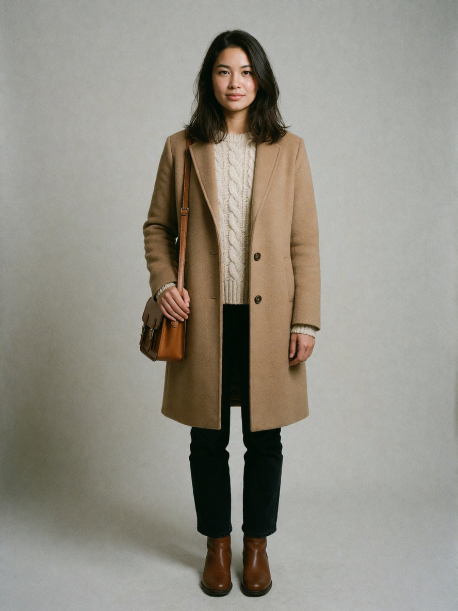 | 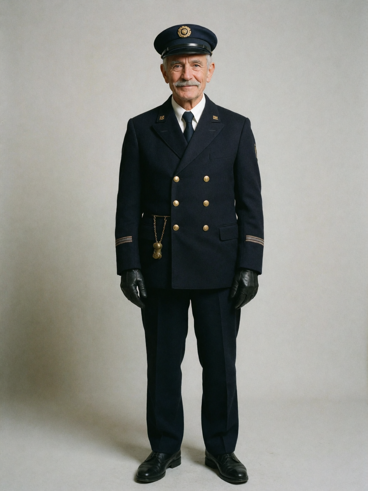 | 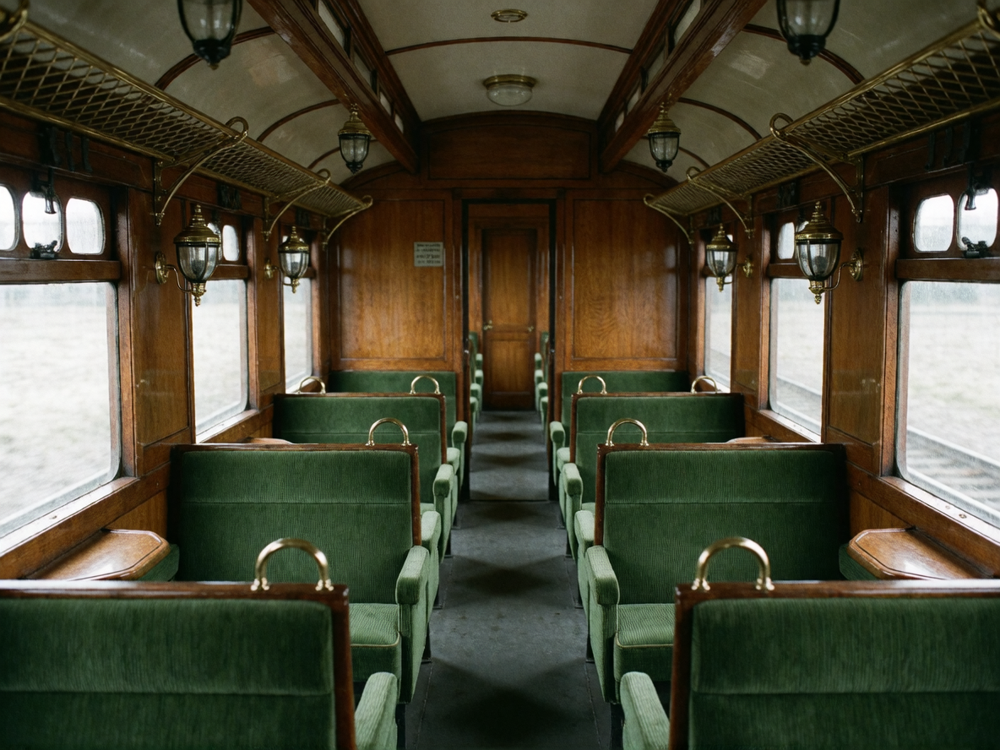 |

Made from the prompts in [`refs/image_prompts.txt`](refs/image_prompts.txt).

### Every two seconds

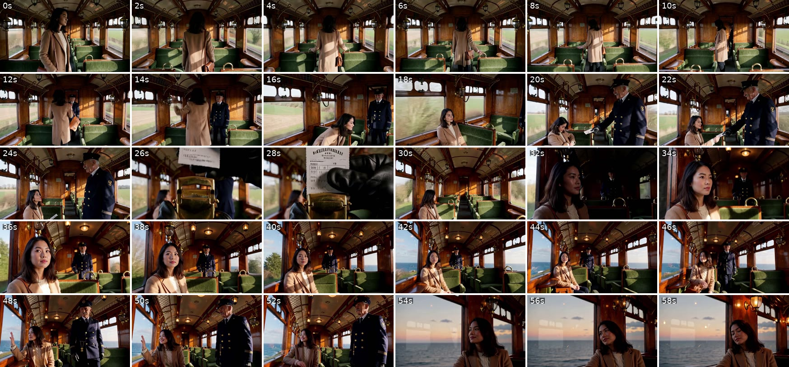

### Prompt

<details>
<summary><code>prompt.txt</code> (click to expand)</summary>

```text
# Example: one-minute Ref2VA showcase for the Endless Sampler (Advanced node, use_full_prompt on).
# <Picture 1> = refs/picture_1_traveller.png, <Picture 2> = refs/picture_2_conductor.png, <Picture 3> = refs/picture_3_carriage.png
# Latent length must be 1433 frames (59.708 s at 24 fps).
# Cuts sit at local 0:00.500 inside each block: the first 0.5 s continues the previous shot,
# because the 5-frame context carries the previous chunk's picture into every chunk start.
# chunk_frames = 226, 226, 175, 73, 73, 73, 226, 226, 175
# context_keyframes = 5
# total duration (frames) = 1433
# chunks = 9
subject_definitions:
<Subject 1> is the young woman in <Picture 1>, with shoulder-length dark hair, a camel wool coat over a cream cable-knit sweater, dark trousers, and a small tan leather satchel.
<Subject 2> is the elderly conductor in <Picture 2>, with a neat grey moustache, a navy double-breasted uniform with brass buttons, a navy peaked cap with a brass badge, and black leather gloves.
<Subject 3> is the vintage railway carriage in <Picture 3>, with polished wood-panelled walls, green velvet seats with brass grab handles, brass mesh luggage racks, brass lantern wall lamps, and wide sash windows.

summary:
[reference generation] The target video shows <Subject 1> and <Subject 2> in <Subject 3>.

retention_analysis:
<Subject 1> (appears in [Shot 1], [Shot 2], [Shot 4], [Shot 5], [Shot 6]): fully_preserved - the woman's identity, shoulder-length dark hair, camel wool coat, cream cable-knit sweater, and tan leather satchel are retained.
<Subject 2> (appears in [Shot 2], [Shot 3]): fully_preserved - the conductor's identity, grey moustache, navy uniform with brass buttons, peaked cap, and black gloves are retained.
<Subject 3> (appears in [Shot 1], [Shot 2], [Shot 4], [Shot 5], [Shot 6]): fully_preserved - the wood-panelled walls, green velvet seats, brass luggage racks, brass lantern lamps, and sash windows are retained.

detailed_description:
The target video uses a realistic, cinematic 35mm film style with soft natural light and gentle film grain.
[Shot 1] A slow, continuous handheld following shot trails <Subject 1> from behind as she walks alone down the aisle of <Subject 3>, the train swaying gently and afternoon light flickering across the wood panelling. She stops at a window seat, lifts her satchel onto the brass rack, sits down, and watches rolling inland farmland slide past the glass.
[Shot 2] At 00:18.917, the shot cuts to a medium two-shot. <Subject 2> (S1) stops beside her seat and holds out a gloved hand, saying warmly, <d>[English] Ticket, please.</d> <Subject 1> (S2) hands him a paper ticket and asks, <d>[English] Is it always this quiet?</d> <Subject 2> (S1) smiles under his moustache, <d>[English] Only until the coast.</d> He tips his cap and walks away down the aisle.
[Shot 3] At 00:26.000, the shot cuts to an extreme close-up of a brass ticket punch clipping a neat hole in the paper ticket with a sharp metallic click.
[Shot 4] At 00:28.833, the shot cuts to an over-the-shoulder view past the seated <Subject 1> through her window as the train plunges into a dark stone tunnel.
[Shot 5] At 00:31.667, the shot cuts to a close-up of <Subject 1>, still seated, amber tunnel lamps sweeping across her face. The train bursts out of the tunnel into golden light, and the camera slowly pulls back to a medium shot as the sea opens up beyond her window. She presses her palm to the glass, smiles, and leans back into her seat.
[Shot 6] At 00:52.917, the shot cuts to a close-up of <Subject 1> resting against the window at dusk, an orange sky fading over the dark sea outside. The brass lamps glow on and her eyes slowly close.

overall_soundscape:
The steady clatter of train wheels over rail joints and the soft creak of the wooden carriage continue throughout the scene.

non_diegetic_music:
A gentle solo piano theme plays softly throughout.
# ---- chunks ----
The target video uses a realistic, cinematic 35mm film style with soft natural light and gentle film grain.
[Shot 1] A slow, continuous handheld following shot trails <Subject 1>, the young woman with shoulder-length dark hair, a camel wool coat over a cream cable-knit sweater, and a tan leather satchel on her shoulder, as she walks away from camera down the aisle of <Subject 3>, the vintage carriage with polished wood-panelled walls, green velvet seats with brass grab handles, brass mesh luggage racks, and wide sash windows. She is the only person in the carriage; every seat is empty. The train sways gently; afternoon light flickers through the windows and slides across the wood panelling, and rolling inland farmland drifts past outside. She steadies herself with one hand on a seat back as she walks. At 0:06.000, she slows and looks toward an empty window seat on her left.
---
The camera keeps following close behind <Subject 1> without a break as she stops at the window seat, alone in the empty carriage. She slips the leather satchel off her shoulder and lifts it onto the brass luggage rack, then sits down on the green velvet seat facing forward. The camera drifts round to a three-quarter profile as she turns toward the sash window. Rolling inland farmland and green fields slide past the glass. She exhales and settles into the seat, the carriage swaying softly around her.
---
The three-quarter profile of <Subject 1> seated at the window holds for a moment. [Shot 2] At 0:00.500, the shot cuts to a medium two-shot inside <Subject 3>: <Subject 1> (S2), the dark-haired woman in the camel coat, remains seated at the window with green farmland passing outside, as <Subject 2> (S1), the elderly conductor with a neat grey moustache, navy double-breasted uniform with brass buttons, navy peaked cap, and black leather gloves, stops in the aisle beside her. He holds out a gloved hand and says warmly, <d>[English] Ticket, please.</d> She takes a paper ticket from her coat pocket, hands it over, and asks with quiet curiosity, <d>[English] Is it always this quiet?</d> <Subject 2> (S1) smiles beneath his moustache and answers in a gravelly voice, <d>[English] Only until the coast.</d> At 0:06.000, he tips his cap and turns away down the aisle while she stays seated.
---
The two-shot holds for a moment as the conductor turns away. [Shot 3] At 0:00.500, the shot cuts to an extreme close-up of a black-gloved hand closing a polished brass ticket punch on the paper ticket. The punch clips a neat round hole with a sharp metallic click, and a tiny paper disc falls away.
---
The close-up of the ticket punch holds for a moment. [Shot 4] At 0:00.500, the shot cuts to an over-the-shoulder view from behind <Subject 1>, seated alone at her window, looking out through the sash window at green fields rushing past. At 0:01.500, the train plunges into a dark stone tunnel and the daylight outside snaps to black. The wheel clatter swells into a hollow, echoing roar.
---
The dark window holds for a moment. [Shot 5] At 0:00.500, the shot cuts to a close-up of <Subject 1>, the dark-haired woman in the camel coat, seated alone at her window in near darkness inside the tunnel. Amber tunnel lamps sweep across her face one after another in a steady rhythm as she gazes out, her expression still and expectant.
---
The close-up of <Subject 1> continues without a break, amber tunnel lamps sweeping across her face as she sits at the window. At 0:01.000, the train bursts out of the tunnel and warm golden sunlight floods across her face all at once. The echoing roar falls away to the steady rhythm of the wheels. The camera begins a slow, steady pull-back, revealing her seated on the green velvet seat beside the sash window, alone in the carriage, and beyond the glass a wide blue sea opens up, sunlight glittering on the water.
---
The slow pull-back continues without a break until <Subject 1> sits in a medium shot at her window, the golden light warm on her camel coat and cream sweater, the empty green velvet seats around her. She leans toward the glass and presses her palm flat against it, watching the sea, and a slow smile spreads across her face. At 0:05.000, she lowers her hand and leans back into the seat, eyes still on the water.
---
The medium shot of <Subject 1> at her window holds for a moment. [Shot 6] At 0:00.500, the shot cuts to a close-up of <Subject 1>, the dark-haired woman in the camel coat, seated with her head resting against the wood panelling beside the window at dusk. Outside, an orange sky fades over a dark, calm sea. At 0:03.000, the brass lantern lamps above her flicker on with a soft warm glow. Her eyes slowly close as the train rolls on into the evening.
```

</details>

## Settings

- Node: **Endless Sampler (Advanced)**, `use_full_prompt` on, `prompt.txt` in `full_prompt`
- Latent: 1433 frames (must match `# total duration (frames)`)
- Reference images connected in the order `<Picture 1>`, `<Picture 2>`, `<Picture 3>`
- Sampling: 3 steps with a 3-step distilled LoRA
- `context_keyframes = 5`, video continuation 22 frames

## What it demonstrates

| Chunk | Span | Delivered frames | Role | Still |
|---|---|---|---|---|
| 1 | 226 | 0-225 | Long handheld following shot | 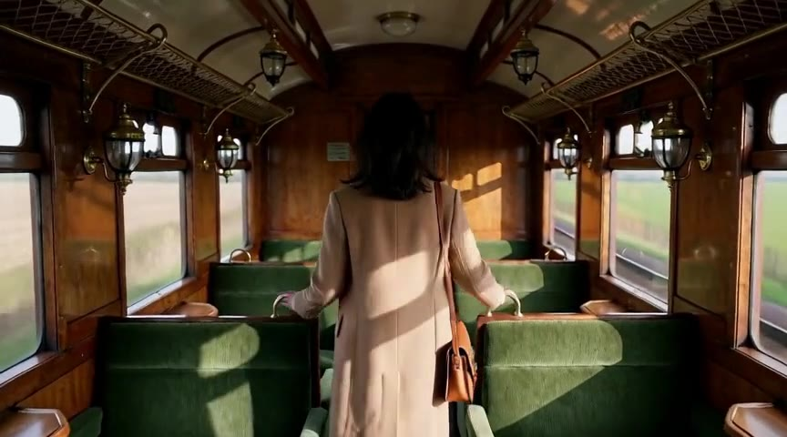 |
| 2 | 226 | 226-446 | Same shot, continued across the boundary with no marker | 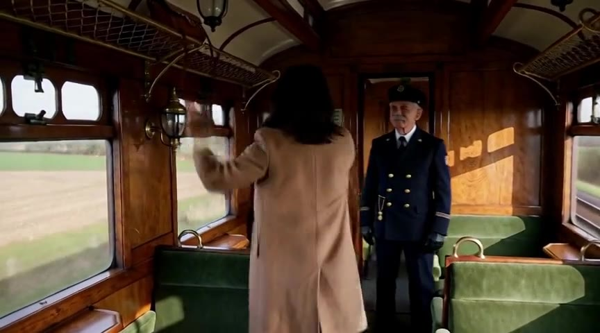 |
| 3 | 175 | 447-616 | Cut, then a three-line dialogue kept inside one chunk | 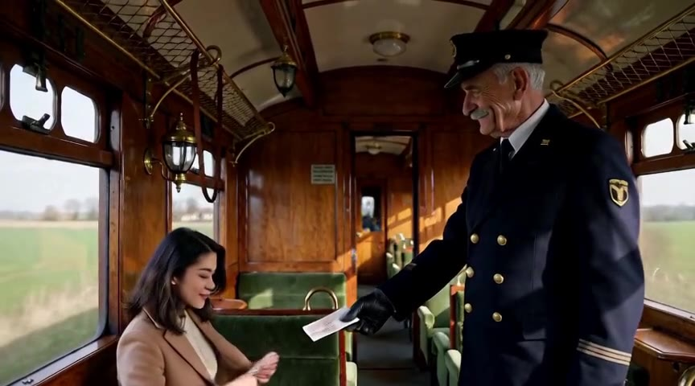 |
| 4 | 73 | 617-684 | Cut to a short insert | 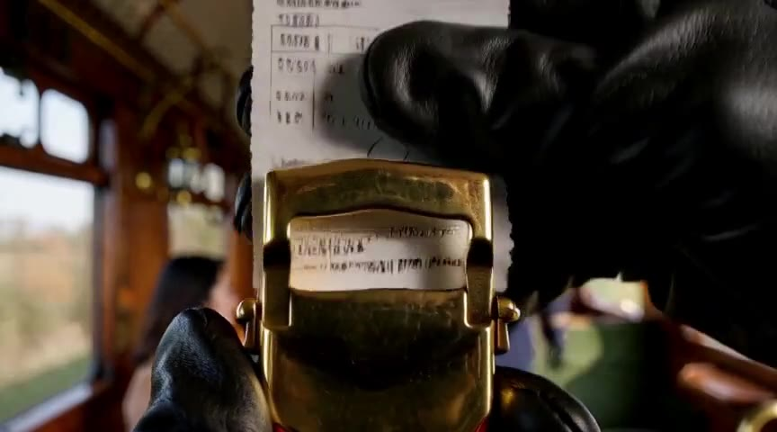 |
| 5 | 73 | 685-752 | Cut, entry into a tunnel | 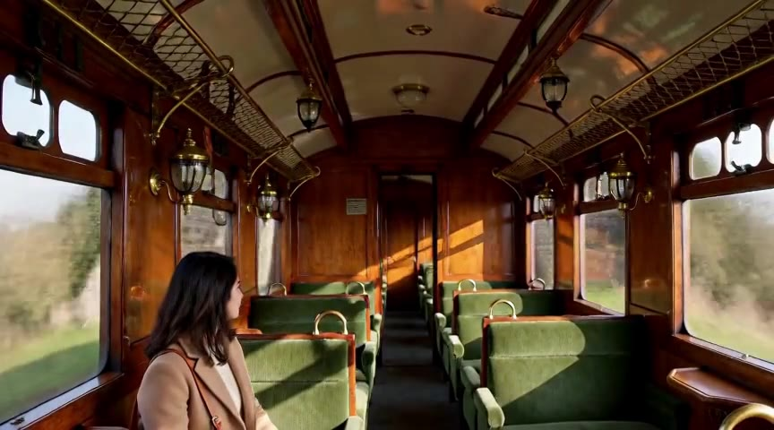 |
| 6 | 73 | 753-820 | Cut to a close-up | 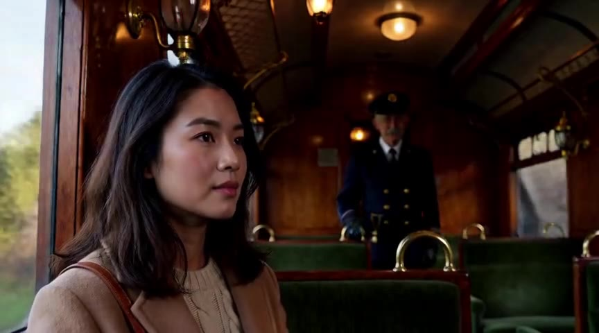 |
| 7 | 226 | 821-1041 | Lighting change and slow pull-back, one continuous shot... | 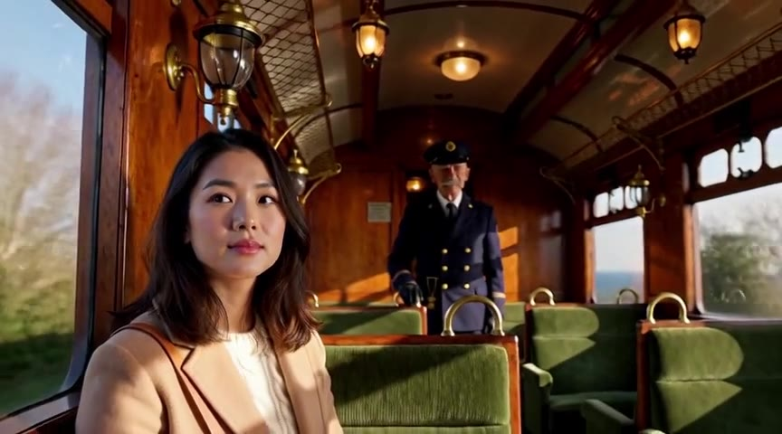 |
| 8 | 226 | 1042-1262 | ...carried on across the boundary | 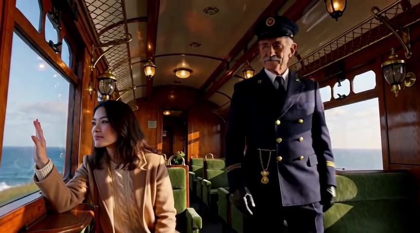 |
| 9 | 175 | 1263-1432 | Cut to the closing shot | 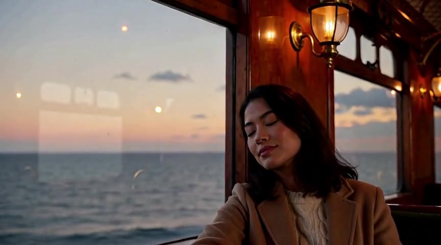 |

- **Seamless joins.** Eight chunk boundaries, none visible: no jump, flicker
  or colour shift. Subjects and set stay consistent for the full minute.
- **Variable spans.** Long chunks for continuous camera moves, a mid-length
  chunk sized to hold a whole conversation, three 3-second chunks for rapid
  inserts.
- **Placed cuts.** Measured hard cuts landed at 18.79 s, 25.88 s and
  52.79 s against planned 18.92 s, 26.00 s and 52.92 s: within three frames.

## Writing cuts at a chunk boundary

A cut written as the very first frame of a block (`[Shot 1]` at
`0:00.000`) does not happen: the context frames hand the previous picture
into the new chunk, and the model continues it. Open the block with half a
second of the previous shot, then cut:

```
The two-shot holds for a moment as the conductor turns away. [Shot 3] At 0:00.500, the shot cuts to ...
```

`0:00.500` local lands about 0.29 s after the chunk's first delivered frame
(the first 5 frames, 0.208 s, are the trimmed overlap).

## Run statistics

RTX 5090 (32 GB), 192 GB system RAM, dynamic VRAM loading.

| Metric | Value |
|---|---|
| Sampler wall time | 5 min 45 s for 59.7 s of video (about 5.8x real time) |
| Whole workflow | 457.6 s including model loads and the final decode |
| Average per chunk | 38.4 s |
| H3 sampling, total | 3 min 16 s (21.8 s per chunk) |
| Qwen re-encode, total | 1 min 21 s (9.0 s per chunk) |
| Continuation VAE decode, total | 38.9 s (4.9 s per call) |
| Other overhead | 28.9 s |
| VRAM, average during DiT evaluation | 22.75 GiB (71.5 %) |
| VRAM, peak | 26.64 GiB (83.7 %) |
| PyTorch high-water | 1.53 GiB allocated, 2.53 GiB reserved |
| Process RAM, peak | 43.6 GiB |

Per chunk:

| Span | Chunk time | of which H3 | Frames delivered per second of chunk time |
|---|---|---|---|
| 226 | 31.3 - 48.3 s | 24.6 - 30.3 s | about 4.6 - 7.2 |
| 175 | 35.7 - 39.6 s | 21.5 - 23.2 s | about 4.3 - 4.8 |
| 73 | 31.9 - 32.5 s | 13.8 - 14.0 s | about 2.1 |

Each chunk carries roughly 18 s of fixed cost (Qwen re-encode, continuation
decode, model initialisation) regardless of span. A 73-frame chunk costs
almost as much wall time as a 226-frame one, so reserve short spans for
places that need a cut, and use the longest span the material allows
everywhere else.
